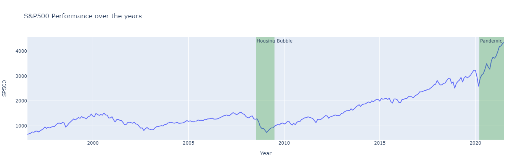

# An analysis of the stock market - are we facing a market bubble? 

This project aims to analyze the stock market's current and historical data and answer to the question 'are we facing a market bubble?'. The team analyzed the gathered data via Python's packages and Data Visualization: Pandas, Numpy, Plotly.. (add more). 

The following questions were answered throughout our analysis:

Are the interest rates and economic growth showing signs of a bubble?
[Analysis of the Economic Growth(GDP) and Interest Rates](https://github.com/yandomingos/project_1/blob/main/Interest_rates_and_gdp.ipynb)

One of the main causes of a financial bubble is the abundance of money in the market. When long term interest rates are lowered, banks are incentivized to give more credit thorugh the landing process. This 'bubbly' process most of the time leads to the formation of a bubble in the economy.
As per shown on graph, interest rates have been lowering signifficantly and were at the lowest in 2020, it went back up at the beginning of the year, however, slowed down again mid-year. 

The slow down of th economy is one of the main indicators that the market is going to crash. As per shown on graph, 2020 showed an economic slow down because of the pandemic, however, things started picking up rapidly after with government incentives. Additionally, in comparison to the 2008 crash, the slow down was a lot more significant in 2020.
What impacts do the economic impacts on the stock markets?

[Analysis of other Economic indicator and GDP](https://github.com/yandomingos/project_1/blob/main/project1.ipynb)
We tried to investiage the relationship of each economic indicators with the stock market performance (S&P500) by using the panada function corr(), and we found that the money supply and inflation rate has positive correlation with the S&P500 return.  Seaborn library was utlitlzed to plot the heatmap to show the correlation matrix.

We observed that SP500 has a positive correlation with the money supply, and we will investigate further with the money supply.  By using the hvplot function, we plotted the money supply and the SP500 return.  We can find a magnitude of 4 times money supply being injected during the pandemic while the S&P500 has been risen more than 68% since the beginning pandemic.  We can see that the money supply has direct relation with the stock market performance.  As investor tried to find ways to invest their money in the stock market while US government increasing the enormous amount of money into the economy.

We also looked into the other important indicator such GDP with S&P 500 and the ratio of S&P 500 to GDP to see any insight of the growth of GDP with the SP500.  The growth rate of S&P500 has gone up 200% while GDP growth only went up by about 15%.  This shows that the stock market has risen so drastically and at an alarming rate.  We also observed that the growth of S&P500 always way above the growth of GDP when stock market crashed during the bubbles in year 2000 and year 2008.  So, we can foresee a high probabiblity of chance that the current stock market would have a big correction in the near future.

Is there Bullish sentiment in the US stock market and particularly US tech stocks?
[Analysis of Bullish sentiment in the US stock market/large US tech stocks](https://github.com/yandomingos/project_1/blob/main/Alexander's%20Project%201%20Notebook.ipynb)

Question 4

### Contributors
Victor Freire, Yan D, Ivan KN Fung, Alexander McMullan
